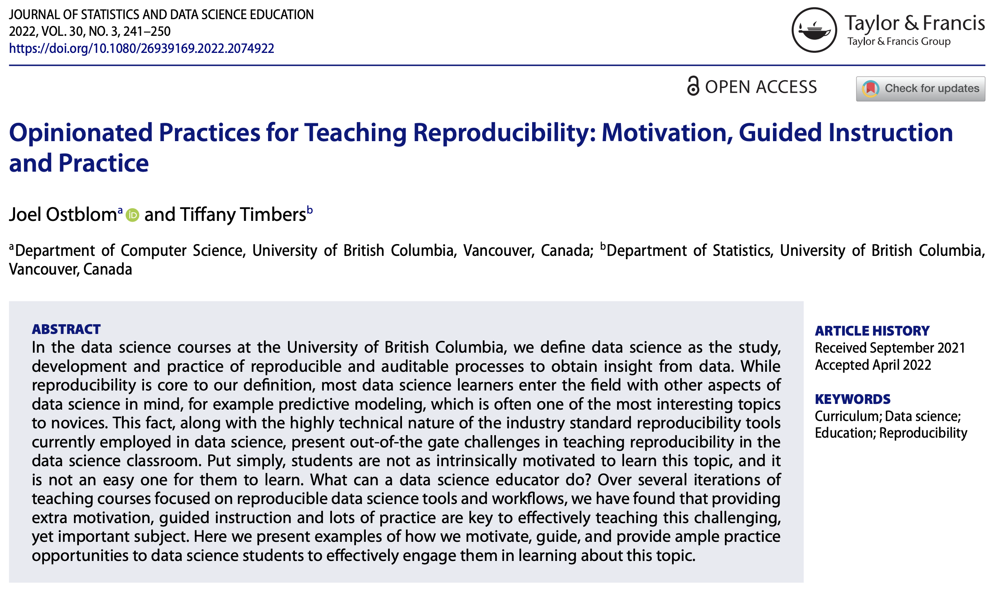
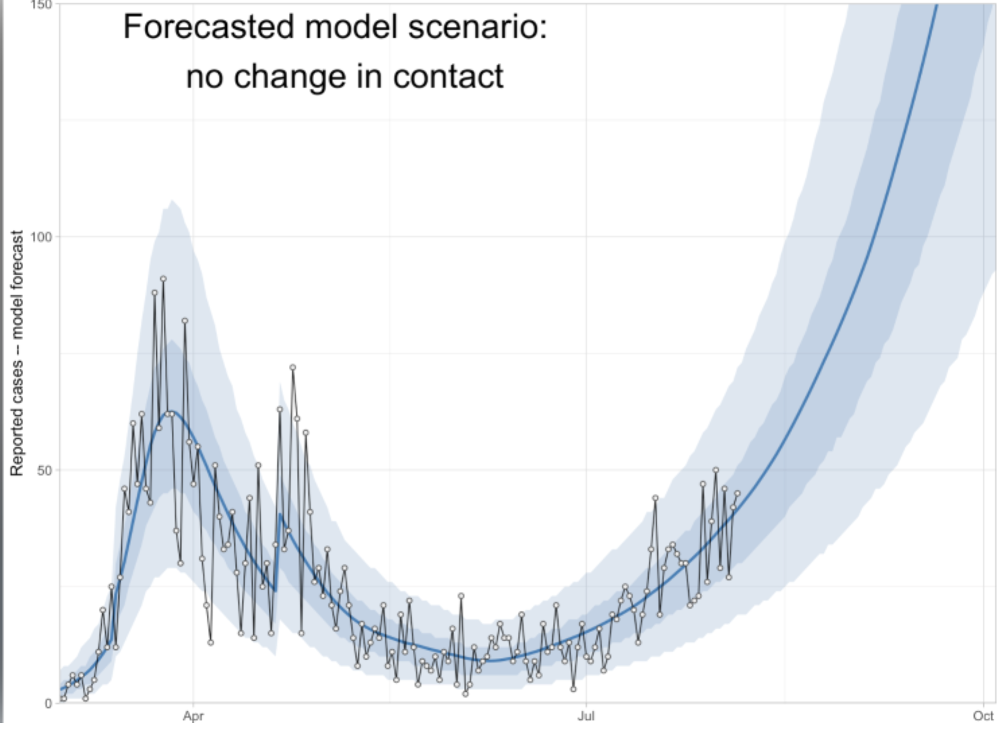
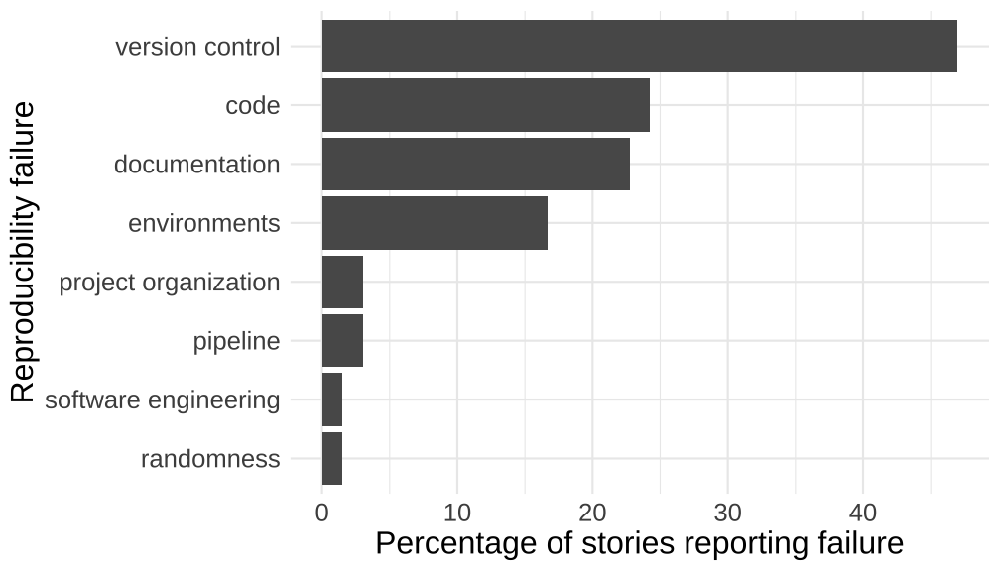
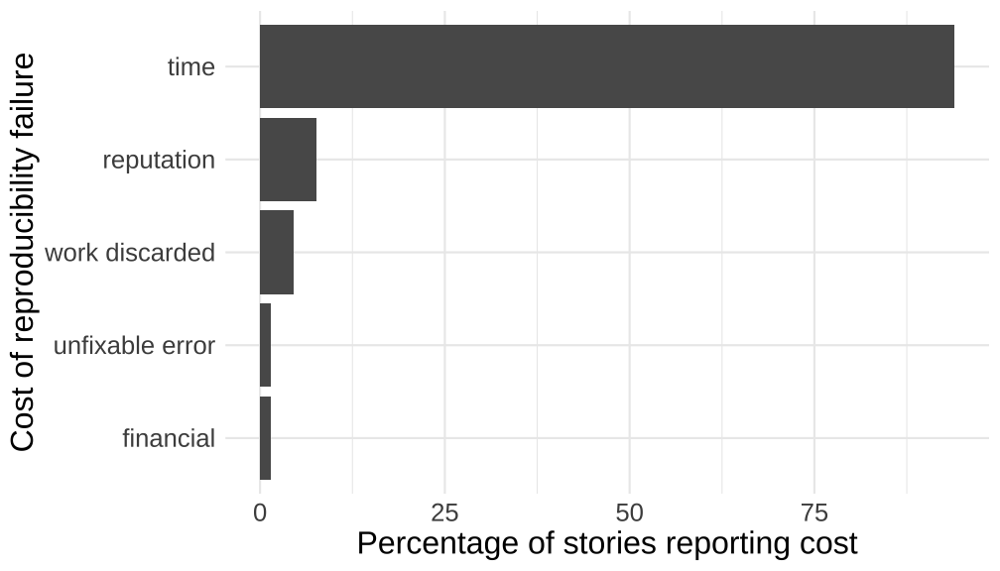
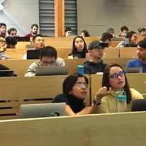
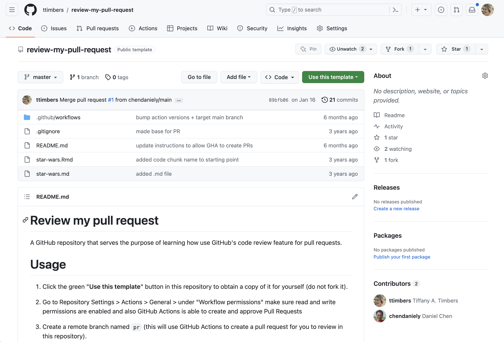
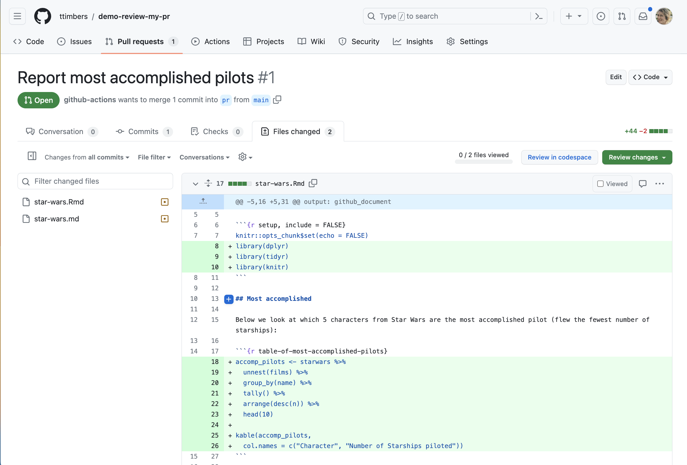

class: middle, center

```{r setup, include=FALSE}
options(htmltools.dir.version = FALSE)
knitr::opts_chunk$set(message = FALSE, 
                      echo = FALSE, 
                      warning = FALSE,
                      fig.align = "center")
```

```{r xaringan-themer, include=FALSE, warning=FALSE}
library(xaringanthemer)
style_duo_accent(
  primary_color = "#444444",
  secondary_color = "#FFE5F3",# old colour #FFE5F3
  inverse_header_color = "#444444",
  link_color = "deeppink",
  title_slide_text_color = "#3d3d3d",
  title_slide_background_image = "img/title-slide-background-light.png",
  title_slide_background_position = "left",
  header_font_google = google_font("Josefin Sans"),
  text_font_google   = google_font("Montserrat", "300", "300i"),
  code_font_google   = google_font("Fira Mono")
)
```

```{css, echo = FALSE}
# source: https://community.rstudio.com/t/using-multiple-font-sizes-for-code-chunks/26405/6
.remark-slide-content {
  font-size: 18px;
  padding: 20px 80px 20px 80px;
}
.remark-code, .remark-inline-code {
  background: #f0f0f0;
}
.remark-code {
  font-size: 18px;
}
.huge .remark-code { /*Change made here*/
  font-size: 200% !important;
}
.small .remark-code { /*Change made here*/
  font-size: 80% !important;
}
.tiny .remark-code { /*Change made here*/
  font-size: 60% !important;
}
```




[https://www.tandfonline.com/doi/pdf/10.1080/26939169.2022.2074922](https://www.tandfonline.com/doi/pdf/10.1080/26939169.2022.2074922)

---

### Reproducibility in data science courses at UBC

Courses where we *explicitly* teach reproducibility for data science

| Course   | Title                                | Level            | Reproducibility topic(s) |
|----------|--------------------------------------|------------------|--------------------------|
| [DSCI 100](https://ubc-dsci.github.io/dsci-100/README.html) | Introduction to data science         | undergraduate    | code for analysis, version control |
| [DSCI 310](https://ubc-dsci.github.io/dsci-310-student/) | Reproducible and trustworthy workflows for data science | undergraduate | file naming & organization, version control, reproducible reports, environments, data analysis pipelines, software packages |
| [DSCI 521](https://github.com/UBC-MDS/DSCI_521_platforms-dsci) | Computing platforms for data science | graduate         | file naming & organization, version control, reproducible reports, environments |
| 
| [DSCI 522](https://github.com/UBC-MDS/DSCI_522_dsci-workflows) | Data science workflows               | graduate         | version control, reproducible reports, environments, data analysis pipelines |
| [DSCI 524](https://github.com/UBC-MDS/DSCI_524_collab-sw-dev) | Collaborative software development   | graduate         | version control, software packages |

---


class: inverse, center, middle

## Data Science:

### *the study, development and practice* 
### *of reproducible and auditable processes* 
### *to obtain insight from data*

---


<br><br>

### Reproducible analysis:

#### *reaching the same result given the same input, computational methods and conditions*<sup>1</sup>.

<br><br>

--

### Auditable analysis,

#### *a readable record of the steps used to carry out the analysis as well as a record of how the analysis methods evolved*.<sup>2</sup>

<br><br>


.footnote[
[1] National Academies of Sciences, 2019

[2] Parker, 2017 and Ram, 2013
]

---

class: middle

### Why do we adopt this definition?

.pull-left[
<br><br>

- It is important that insights from data science are trustworthy

<!--Russell Hardin (https://as.nyu.edu/faculty/russell-hardin.html) wrote: 
“ Trust involves giving discretion to another to affect one’s interests.”

Data science insights are very often used to make important, 
real-life decisions

-->

- Reproducible and auditable methods are one of the expectations for trustworthy data science

<!--

 Don Tapscott ( The Naked Corporation) describes trust as: 
 honest, considerate, accountable, and transparent.

"Francis Fukuyama’s definition of trust:
“ Trust is the expectation that arises within a community of regular,
honest, and cooperative behavior, based on commonly shared norms, 
on the part of other members of that community.”"

-->
]

.pull-right[


**Source: [Image by jcomp on Freepik](https://www.freepik.com/free-photo/tourists-go-up-hill-sunrise_6172108.htm#query=trust&position=6&from_view=search&track=sph)**
]

---

<br><br><br><br><br>

### We cannot trust non-reproducible and non-auditable analyses because they:

--

1. lack evidence that the results could be regenerated

--

2. we don't know enough details of how they were created

--

3. there is an insufficient record of how and why analysis decisions were made

---

<br><br><br>

### Examples of things that can go wrong without reproducible practices

--

- An interesting result that you cannot recreate 😞

--

- Your email inbox is full of information related to the project that only you have access too 😫

--

- A small change to the analysis code requires re-running the entire thing, *and takes hours...* 😧

--

- Activation time to becoming productive after taking a break from the project is hours to days 😴

--

- Code that can only be run on one machine, *and you don't know why...* 😵

---

class: center

### The lagniappe<sup>1</sup> of reproducibile data science methods:

### more effective collaboration!


<!--Data science is an inherently collaborative discipline, 
and adhering to reproducible and auditable data science methods 
greatly facilitates the act of collaborating in many contexts, 
further emphasizing the importance of learning this skill well.
-->

.footnote[
[1] [lagniappe: a small gift given with a purchase to a customer, by way of compliment or for good measure; bonus.](https://www.dictionary.com/browse/lagniappe)
]

---

class: inverse, center, middle

### *So if reproducibility is so important for data science, why is it hard to teach it?*

---

class: center middle

#### Students are more excited about generating insights from data than reproducibility?



*Source: [CTV BC News article on COVID case predictions](https://bc.ctvnews.ca/infectious-disease-modeller-predicts-big-spike-in-b-c-covid-cases-1.5056250)*

---

class: center middle

#### Lack of awareness of the problems with non-reproducible analyses?


*Source: https://cheezburger.com/6600205568/untitled*

---

class: center middle

#### Reproducibility tools are not necessarily smooth and easy to learn?

For example, Git is hard!


*Source: https://xkcd.com/1597/*

---

class: center middle

#### Our expectations of students' learning?


.pull-left[

<br>

We want to actually change their habits or behaviours!

Habits protect individuals from motivational lapses, 
where a desired good behavior is not expressed 
due to a momentary lack of willpower<sup>1</sup>.
]

.pull-right[

*Source: [Star Wars: The Force Awakens](https://giphy.com/gifs/reaction-3240pzelRQkjj9XaiK)*
]


.footnote[
[1] Gardner, Benjamin and Amanda L. Rebar (Apr. 2019). “Habit Formation
and Behavior Change”. en. In: Oxford Research Encyclopedia of Psychology. Oxford University Press. isbn: 978-0-19-023655-7. doi: 10.1093/acrefore/9780190236557.013.129.
]

---

<br><br><br><br><br><br>

### Key things for teaching reproducibility

--

1. placing extra emphasis on motivation

--

2. guided instruction

--

3. lots of practice!!!

---

<br><br><br><br><br><br>

### Key things for teaching reproducibility

1. <font color="#CF006F">placing extra emphasis on motivation</font>

2. guided instruction

3. <font color="#CF006F">lots of practice!!!</font>

---

class: inverse

<br><br><br><br><br><br>

### Strategies for placing extra emphasis on motivation

--

1. Let them fail (in a controlled manner)

--

2. Study cases of failures with real world consequences

--

3. <font color="#CF006F">Tell stories from the trenches</font>

---

### Tell stories from the trenches

Exercise prompt:

1. Think and write down a non-reproducible, or non-auditable, workflow 
you have used before at work, on a personal project, or in course work, 
that negatively impacted your work somehow 
(make sure to include this in the story). 
Here’s an example: <br> <br> *As a Masters student, I started to use R to do my statistical analysis. I obtained the results I needed from running my code in the R console and copying the results into the word document that was my manuscript. Six months later we were working on revisions requested by the reviewers and I could not remember which version of the code I ran to get my results. I eventually figured it out through much trial and error, but the process was inefficient and very stressful.*
<br>*–- Tiffany Timbers*

2. When prompted, paste your story in the Google doc (link to be shared in class)

---

### Tell stories from the trenches

Sample student story:

*"In my line of work, my colleagues and I heavily relied on SQL queries to withdraw data from database. She always forgot to save the queries while just sending me an excel file to read. Sometimes (Most of the time) when I cross checked the data, the result didn't match. It usually required hours of troubleshooting to figure out where the gap was between my query and her data. ¯\_(ツ)_/¯"*

-- Master of Data Science student, UBC

<br>

- **Reproducibility failure > methods not recorded as code** 
- **Impact of reproducibility failure > loss of time**

---

### Tell stories from the trenches

Sample student story:

*“When I was working in my last job creating a database, I was working between two different computer systems. I had written the code on my local computer (a windows) but it was being deployed on a Linux command line system. To debug my code it was easier to do on my computer but certain lines of code were specific to the linux machine vs. the window machine. While I was using version control I had a really hard time keeping track of which script was which and it caused me to waste lots of time and energy trying to fix the issue”*

-- Master of Data Science student, UBC

<br>

- **Reproducibility failure > lack of a shippable and shareable computational environment** 
- **Impact of reproducibility failure > loss of time**


---

### Causes and impacts of reproducibility failures from students' stories from the trenches


.pull-left[

]

.pull-right[

]


---

### Tell stories from the trenches

Exercise prompt for further engagement:

Follow the instructions below 
for each story share in the class stories from the trenches Google document.

- Read the story and reflect on which of the themes listed below 
was likely the biggest cause of the reproducibility 
or transparency failure described in the story. 

- Label the story with the emoji 
corresponding to the chosen theme from the table below:

| Reproducibility and transparency themes | Emoji label |
|-----------------------------------------|-------------|
| Code                                    | ⌨️ (keyboard) |
| Computational environments              | 💻 (laptop)  |
| Software design                         | 💾 (floppy disk) |
| Data analysis pipeline                  | ➡️ (right arrow) |
| Documentation                           | 📄 (page facing up)
| Project organization                    | 🗃 (card file box)|
| Randomness                              | 🎲 (game die) |
| Version control                         | 📜 (scroll) |

---

Exercise prompt for further engagement (cont'd):

- Re-read the story and reflect on what the primary cost was 
from the reproducibility or transparency failure described in the story. 

- Label the story with the emoji 
corresponding to the chosen cost from the table below:

| Reproducibility and transparency failure cost | Emoji label |
|-----------------------------------------------|-------------|
| Financial                                     | 💸 (money with wings) |
| Reputational                                  | 🎖 (military medal)  |
| Time                                          | 🕰 (mantelpiece clock) |
| Unfixable error                               | 💥 (collision) |
| Work discarded.                               | 🗑️(wastebasket)|

---

class: middle

### Tell stories from the trenches

.pull-left[
Why I really like this exercise:

- Self reflection
- Community building ("you are not alone!")
- Engaging peer learning
- Relatable
]

.pull-right[


UBC MDS student classroom
]

---

class: inverse

<br><br><br><br><br><br>

### Strategies for lots of practice!!!

--

1. "I do, you do"

--

2. Interleave reproduciblity practice with other data science tasks

--

3. <font color="#CF006F">Pre-bake exercises</font>

---

### Pre-bake exercises

Some reproducibility workflows require some time consuming, 
or complex prerequisite work to have been done before it makes sense to do them.

In such cases. "pre-baking" exercises to a particular point
is helpful for providing practice opportunities.


.pull-left[


Source: https://peopletv.com/video/martha-bakes-angel-food-cake/
]

--

.pull-right[
Examples include:

- automating the running of scripts via a data analysis pipeline (e.g., Makefile)

- using `bookdown` or Jupyter book to automate figure and table numbering

- organizing GitHub issues into milestones and a project board ([example exercise](https://github.com/ttimbers/mds-homework))

- performing a code review on a pull requests ([example exercise](https://github.com/ttimbers/review-my-pull-request))
]

---

class: middle

### Pre-baked review my pull request exercise

.pull-left[
Reviewing pull requests is a hard task to get a lot of practice on! 

Why? 

Before a pull request can be reviewed, a lot needs to happen to set the stage:

- Setup a GitHub repository
- Commit some files
- Make a change on another branch (or in a forked repo)
- Open a pull request
]


.pull-right[
 
 
**Source: [Image by jcomp on Freepik](https://www.freepik.com/free-photo/inclined-wooden-block-tower-jenga-game-with-hand-risk-concept_3762456.htm#page=2&query=jenga&position=27&from_view=search&track=sph)**
]

 
---

class: middle, center

### Exercise: Pre-baked review my pull request exercise



[review-my-pull-request GitHub repository](https://github.com/ttimbers/review-my-pull-request)

---

class: middle, center

### Exercise: Pre-baked review my pull request exercise



[review-my-pull-request GitHub repository](https://github.com/ttimbers/review-my-pull-request)

---

class: middle

### Pre-baked review my pull request exercise

.pull-left[
Why I really like this exercise:

- Allows focused practice on what students are supposed to be learning
- Mistakes on earlier steps do not prevent practice
- Very scalable
]

.pull-right[


UBC MDS student classroom
]

---

class: inverse, center, middle

# Wrap up

---

class: middle

### Key things for teaching reproducibility

#### <font color="#CF006F">1. Extra emphasis on motivation</font>

#### 2. Guided instruction

#### <font color="#CF006F">3. Lots of practice!!!</font>

---

class: center, middle


*Source: https://giphy.com/gifs/opinion-the-big-lebowski-x1yhRwlqxBiQU*

---

class: middle

### Anectodal evidence

- reduced technical debt in UBC Master of Data Science Capstone projects 
as we have gained more experience teaching reproducibility

### Feedback from Alumni

- *"I had my [COMPANY] Git training today for the data engineers/scientists and I wanted to tell you that everything I learned in your class about git was extremely helpful. You did such an amazing job teaching everything we need to know about git and working in technology, (I personally think I learned much more in your class than in my training here in SF)."*

- *"...the use of Git and Docker and the strong focus on reproducibility are of the best technical skills our program offer."*

---

### References

Gardner, Benjamin and Rebar, Amanda L. (Apr. 2019). “Habit Formation
and Behavior Change”. en. In: Oxford Research Encyclopedia of Psychology. Oxford University Press. isbn: 978-0-19-023655-7. doi: 10.1093/acrefore/9780190236557.013.129.

National Academies of Sciences, Engineering, and Medicine and others
(2019). Reproducibility and replicability in science. National Academies
Press.

Ostblom, Joel and Timbers, T.A. (2022). Opinionated Practices for Teaching Reproducibility: Motivation, Guided Instruction
and Practice. Journal of Statistics and Data Science Education 30(3) pp. 241–250.
https://doi.org/10.1080/26939169.2022.2074922

Ram, Karthik (2013). “Git can facilitate greater reproducibility and increased
transparency in science”. In: Source code for biology and medicine 8.1,
pp. 1–8.

### Credits

[Title slide illustration](https://www.freepik.com/free-vector/couple-professionals-analyzing-graphs_6974868.htm) was created by pch.vector  - www.freepik.com.

---

### Acknowledgements

.pull-left[
UBC Master of Data Science teaching team (past and present)
- Tomas Beuzen
- Vincenzo Coia
- Giulio Valentino Dalla Riva
- Florencia D'Andrea
- Mike Gelbart
- Gittu George
- Varada Kolhatkar
- Rodolfo Lourenzutti
- Firas Moosvi
- Quan Nguyen
- [Joel Ostblom](https://joelostblom.com/) (co-author on this work)
- Alexi Rodríguez-Arelis
- Arman Seyed-Ahmadi

DSCI 100 teaching team
  - Trevor Campbell
  - Melissa Lee
]

.pull-right[
2021-22 Master of Data Science teaching team

]
---

class: inverse, center, middle

# Questions?


### @TiffanyTimbers

### talk slides: [bit.ly/opin-prac-repro](https://ttimbers.github.io/jsm2023-teaching-reproducibility-and-responsible-workflow/2-timbers-opinionated-practices-for-teaching-reproducibility/timbers-opinionated-practices-for-teaching-reproducibility.html#1)


#### JDSE paper: https://www.tandfonline.com/doi/pdf/10.1080/26939169.2022.2074922

