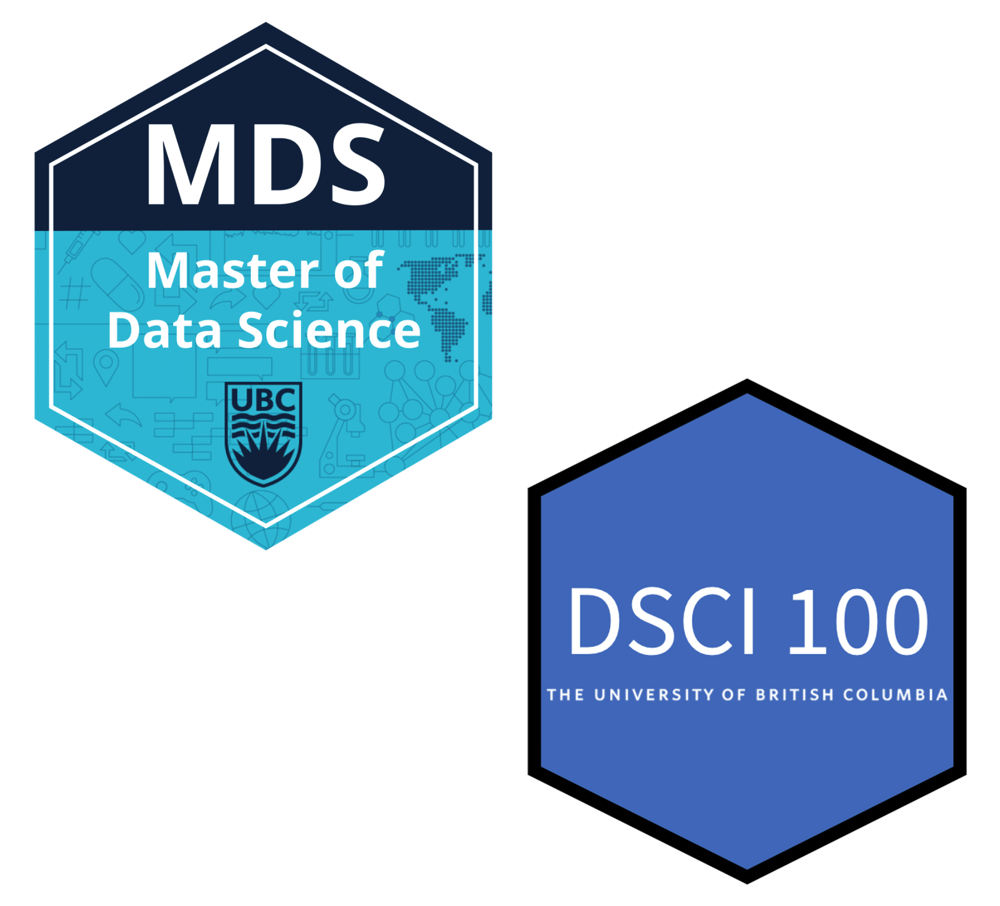

### Reproducibility in data science courses at UBC

.pull-left[

]

.pull-right[
Courses where we **explicitly** teach reproducibility for data science

| Course   | Title                                | Level            | Reproducibility topic(s) |
|----------|--------------------------------------|------------------|--------------------------|
| [DSCI 100](https://ubc-dsci.github.io/dsci-100/README.html) | Introduction to data science         | undergraduate    | code for analysis, version control |
| [DSCI 310](https://ubc-dsci.github.io/dsci-310-student/) | Reproducible and trustworthy workflows for data science | undergraduate | file naming & organization, version control, reproducible reports, environments, data analysis pipelines, software packages |
| [DSCI 521](https://github.com/UBC-MDS/DSCI_521_platforms-dsci) | Computing platforms for data science | graduate         | file naming & organization, version control, reproducible reports, environments |
| 
| [DSCI 522](https://github.com/UBC-MDS/DSCI_522_dsci-workflows) | Data science workflows               | graduate         | version control, reproducible reports, environments, data analysis pipelines |
| [DSCI 524](https://github.com/UBC-MDS/DSCI_524_collab-sw-dev) | Collaborative software development   | graduate         | version control, software packages |

---

class: inverse, center, middle

# Data Science:

### *the study, development and practice* 
### *of reproducible and auditable processes* 
### *to obtain insight from data*

---

class: middle

## Reproducible analysis:

#### *reaching the same result given the same input, computational methods and conditions*1.

## Transparent analysis,

#### *a readable record of the steps used to carry out the analysis as well as a record of how the analysis methods evolved*.2

.footnote[
[1] National Academies of Sciences, 2019

[2] Parker, 2017 and Ram, 2013
]

---

class: middle

## Why do we adopt this definition?

We believe that data science work should both bring insight 
and employ reproducible and auditable methods so that
trustworthy results and data products can be created.

Data products can be built via other methods, 
but we lack confidence in how the results or
products were created.

We believe this stems from non-reproducible and
non-auditable analyses:

1. lacking evidence that the results or product could be regenerated given
the same input computational methods, and conditions

2. lacking evidence of the steps taken during creation

3. having an incomplete record of how and why analysis decisions were
made

---

## Examples of things that can go wrong without reproducible practices

- An interesting result that you cannot recreate 😞

- Your email inbox is full of information related to the project that only you have access too 😫

- A small change to the analysis code requires re-running the entire thing, *and takes hours...* 😧

- Activation time to becoming productive after taking a break from the project is hours to days 😴

- Code that can only be run on one machine, *and you don't know why...* 😵

---

class: inverse, center, middle

## *So if reproducibility is so important for data science, why is it hard to teach it?*

---

class: middle

## Possibilities:

1. Lack of awareness of the problem?

2. Reproducibility is an inconvenient means to end, rather than an important skill?

3. Reproducibility does not directly lead to novel insights?

---

class: middle

## Key things for teaching reproducibility

### 1. placing extra emphasis on motivation

### 2. guided instruction

### 3. lots of practice!!!

---

class: middle

# Strategies for placing extra emphasis on motivation

---

class: middle

# Strategies for guided instruction

---

class: middle

# Strategies for lots of practice!!!

---

class: inverse, center, middle

# Wrap up

---

class: middle

## Key things for teaching reproducibility

### 1. Extra emphasis on motivation

### 2. Guided instruction

### 3. Lots of practice!!!

---

### References

Aboumatar, Hanan and Robert A. Wise (Oct. 2019). “Notice of Retraction.
Aboumatar et al. Effect of a Program Combining Transitional Care and
Long-Term Self-Management Support on Outcomes of Hospitalized Patients With Chronic Obstructive Pulmonary Disease: A Randomized Clinical Trial. JAMA. 2018;320(22):2335-2343.” In: JAMA 322.14, pp. 1417–1418. issn: 0098-7484. doi: 10.1001/jama.2019.11954.

Fournier, Marion et al. (Nov. 2017). “Effects of Circadian Cortisol on the Development of a Health Habit”. eng. In: Health Psychology: Official Journal
of the Division of Health Psychology, American Psychological Association
36.11, pp. 1059–1064. issn: 1930-7810. doi: 10.1037/hea0000510.

Gardner, Benjamin and Amanda L. Rebar (Apr. 2019). “Habit Formation
and Behavior Change”. en. In: Oxford Research Encyclopedia of Psychology. Oxford University Press. isbn: 978-0-19-023655-7. doi: 10.1093/acrefore/9780190236557.013.129.

Kelion, Leo (Oct. 2020). “Excel: Why Using Microsoft’s Tool Caused Covid19 Results to Be Lost”. en-GB. In: BBC News.

Lally, Phillippa et al. (2010). “How Are Habits Formed: Modelling Habit Formation in the Real World”. en. In: European Journal of Social Psychology
40.6, pp. 998–1009. issn: 1099-0992. doi: 10.1002/ejsp.674.

National Academies of Sciences, Engineering, and Medicine and others
(2019). Reproducibility and replicability in science. National Academies
Press.

---

---

### Acknowledgements

.pull-left[
UBC Master of Data Science teaching team (past and present)
- Tomas Beuzen
- Vincenzo Coia
- Giulio Valentino Dalla Riva
- Florencia D'Andrea
- Mike Gelbart
- Gittu George
- Varada Kolhatkar
- Rodolfo Lourenzutti
- Firas Moosvi
- Quan Nguyen
- **Joel Ostblom** (co-author on preprint of this talk)
- Alexi Rodríguez-Arelis
- Arman Seyed-Ahmadi

DSCI 100 teaching team
  - Trevor Campbell
  - Melissa Lee
]

.pull-right[
2021-22 Master of Data Science teaching team

]
---

class: inverse, center, middle

# Questions?

### @TiffanyTimbers

#### talk slides: *url-TBD*
#### paper: https://www.tandfonline.com/doi/pdf/10.1080/26939169.2022.2074922
