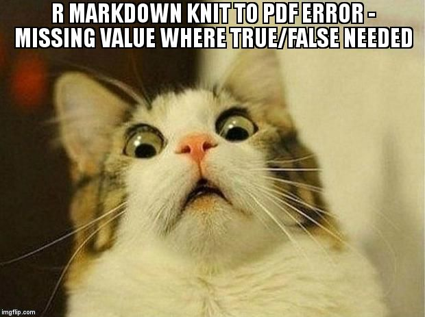
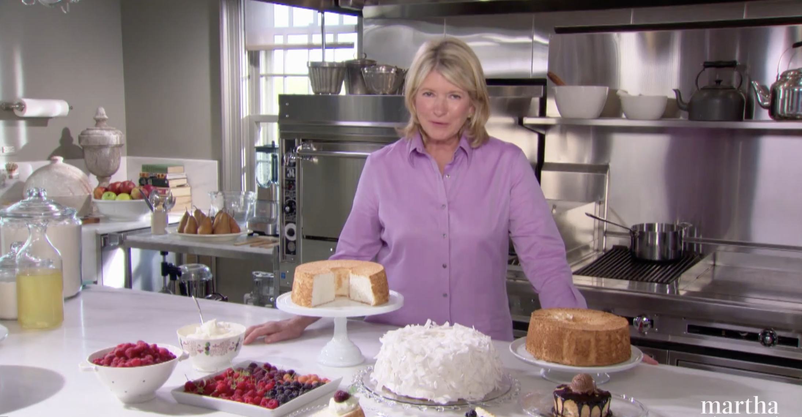

```{r setup, include=FALSE}
options(htmltools.dir.version = FALSE)
knitr::opts_chunk$set(message = FALSE, 
                      echo = FALSE, 
                      warning = FALSE,
                      fig.align = "center")
```

```{r xaringan-themer, include=FALSE, warning=FALSE}
library(xaringanthemer)
style_duo_accent(
  primary_color = "#9F999C",
  secondary_color = "#FFE5F3",
  inverse_header_color = "#8F8C8E",
  link_color = "deeppink",
  title_slide_text_color = "#3d3d3d",
  title_slide_background_image = "img/title-slide-background-light.png",
  title_slide_background_position = "left",
  header_font_google = google_font("Josefin Sans"),
  text_font_google   = google_font("Montserrat", "300", "300i"),
  code_font_google   = google_font("Fira Mono")
)
```

```{css, echo = FALSE}
# source: https://community.rstudio.com/t/using-multiple-font-sizes-for-code-chunks/26405/6
.remark-slide-content {
  font-size: 20px;
  padding: 20px 80px 20px 80px;
}
.remark-code, .remark-inline-code {
  background: #f0f0f0;
}
.remark-code {
  font-size: 24px;
}
.huge .remark-code { /*Change made here*/
  font-size: 200% !important;
}
.small .remark-code { /*Change made here*/
  font-size: 80% !important;
}
.tiny .remark-code { /*Change made here*/
  font-size: 60% !important;
}
```


### Reproducibility in data science courses at UBC


Courses where we **explicitly** teach reproducibility for data science

| Course   | Title                                | Level            | Reproducibility topic(s) |
|----------|--------------------------------------|------------------|--------------------------|
| [DSCI 100](https://ubc-dsci.github.io/dsci-100/README.html) | Introduction to data science         | undergraduate    | code for analysis, version control |
| [DSCI 310](https://ubc-dsci.github.io/dsci-310-student/) | Reproducible and trustworthy workflows for data science | undergraduate | file naming & organization, version control, reproducible reports, environments, data analysis pipelines, software packages |
| [DSCI 521](https://github.com/UBC-MDS/DSCI_521_platforms-dsci) | Computing platforms for data science | graduate         | file naming & organization, version control, reproducible reports, environments |
| 
| [DSCI 522](https://github.com/UBC-MDS/DSCI_522_dsci-workflows) | Data science workflows               | graduate         | version control, reproducible reports, environments, data analysis pipelines |
| [DSCI 524](https://github.com/UBC-MDS/DSCI_524_collab-sw-dev) | Collaborative software development   | graduate         | version control, software packages |

---


class: inverse, center, middle

# Data Science:

### *the study, development and practice* 
### *of reproducible and auditable processes* 
### *to obtain insight from data*

---


<br><br>

### Reproducible analysis:

#### *reaching the same result given the same input, computational methods and conditions*<sup>1</sup>.

<br><br>

--

### Auditable analysis,

#### *a readable record of the steps used to carry out the analysis as well as a record of how the analysis methods evolved*.<sup>2</sup>

<br><br>


.footnote[
[1] National Academies of Sciences, 2019

[2] Parker, 2017 and Ram, 2013
]

--

---

class: middle

## Why do we adopt this definition?

- It is important that insights from data science are trustworthy

<!--Russell Hardin (https://as.nyu.edu/faculty/russell-hardin.html) wrote: 
“ Trust involves giving discretion to another to affect one’s interests.”

Data science insights are very often used to make important, 
real-life decisions

-->

- Reproducible and auditable methods are one of the expectations for trustworthy data science

<!--

 Don Tapscott ( The Naked Corporation) describes trust as: 
 honest, considerate, accountable, and transparent.

"Francis Fukuyama’s definition of trust:
“ Trust is the expectation that arises within a community of regular,
honest, and cooperative behavior, based on commonly shared norms, 
on the part of other members of that community.”"

-->

---

<br><br><br><br><br>

### We cannot trust non-reproducible and non-auditable analyses because they:

--

1. lack evidence that the results could be regenerated

--

2. we don't know enough details of how they were created

--

3. there is an insufficient record of how and why analysis decisions were made

---

class: center, inverse

<!-- add a background of an image of a lagniappe-->

<br><br><br><br><br><br><br><br>

### The lagniappe of reproducibile data science methods:

--

### more effective collaboration!

<!--Data science is an inherently collaborative discipline, 
and adhering to reproducible and auditable data science methods 
greatly facilitates the act of collaborating in many contexts, 
further emphasizing the importance of learning this skill well.
-->

---

<br><br><br>

## Examples of things that can go wrong without reproducible practices

--

- An interesting result that you cannot recreate 😞

--

- Your email inbox is full of information related to the project that only you have access too 😫

--

- A small change to the analysis code requires re-running the entire thing, *and takes hours...* 😧

--

- Activation time to becoming productive after taking a break from the project is hours to days 😴

--

- Code that can only be run on one machine, *and you don't know why...* 😵

---

class: inverse, center, middle

## *So if reproducibility is so important for data science, why is it hard to teach it?*

---

<br><br><br><br><br><br>

<!-- add images to go along with each point-->

### Possibilities:

--

 1. Students are more excited about generating insights from data than reproducibility

--

2. Lack of awareness of the problems with non-reproducible analyses

--

3. Reproducibility tools are not necessarily smooth and easy to learn

---

class: middle

## Key things for teaching reproducibility

### 1. placing extra emphasis on motivation

### 2. guided instruction

### 3. lots of practice!!!

---

class: inverse, center, middle

# On placing extra emphasis on motivation:

---

class: center

## Git is hard!


*Source: https://xkcd.com/1597/*
---

## Git is hard!

Command to view the state of the repository 2 commits ago:
```bash
git checkout HEAD~2
```

Output 🤯:
```bash
Note: switching to 'HEAD~2'.

You are in 'detached HEAD' state. You can look around, make experimental
changes and commit them, and you can discard any commits you make in this
state without impacting any branches by switching back to a branch.

If you want to create a new branch to retain commits you create, you may
do so (now or later) by using -c with the switch command. Example:

  git switch -c <new-branch-name>

Or undo this operation with:

  git switch -

Turn off this advice by setting config variable advice.detachedHead to false

HEAD is now at cea9a00 updated site

```

---

## Git is hard!


---

class: center

## LaTeX errors are often cryptic to new learners



*Source: https://twitter.com/overflow_meme/status/1232185254280138753*

---

class: center

## LaTeX errors are often cryptic to new learners


---
class: center

## Creating environments is painstakingly slow


*Source: https://www.meme-arsenal.com/en/create/meme/1759571*

---

## Creating environments is painstakingly slow

Dockerfile that adds 3 packages to a [rocker](https://www.rocker-project.org/) 
Docker image:
```Docker
FROM rocker/verse:4.1.1

# install R packages
RUN apt-get update -qq && install2.r --error \
    --deps TRUE \
    plotly \
    GGally \
    cowplot

```

Build the Dockerfile:
```bash
time docker build .
[+] Building 198.4s (6/6) FINISHED
...
```

That took about 5 minutes to build on my Macbook pro!!!

---

class: middle

# Strategies for placing extra emphasis on motivation

1. Tell stories from the trenches

2. Study cases of failures with real world consequences

3. Let them fail (in a controlled manner)


---

## Tell stories from the trenches


---

class: inverse, center, middle

# On guided instruction:

---

class: center, middle

### *From our experience, reproducibility is not something that most people or students figure out on their own, or if they do, it is not an efficient process...*

---

class: middle

### Excerpt from Roger Peng's blog post on <br> ["The Role of Theory in Data Analysis"](https://simplystatistics.org/posts/2018-12-11-the-role-of-theory-in-data-analysis/):

#### *There is no need for a new data analyst to learn about reproducibility “from experience”. We don’t need to lead a junior data analyst down a months-long winding path of non-reproducible analyses until they are finally bitten by non-reproducibility (and therefore “learn their lesson”). We can just tell them*

#### *"In the past, we’ve found it useful to make our data analyses reproducible. Here’s a workflow to guide you in your own analyses."*

#### *With that one statement, we can “compress” over 20 years of experience.*

---

class: middle

# Strategies for guided instruction

1. Live demonstration

2. Pre-lecture activities

3. Worksheets

---

## Worksheets

---

---
class: inverse, center, middle

# On lots of practice:
---

class: middle

## **Mastery of a subject often involves consolidating ideas, concepts and theories into long-term memory.** 

## **And consolidating most things into long-term memory requires repetition**<sup>1</sup>.

.footnote[
[1] Ebbinghaus, Hermann (1913). “Memory (ha ruger & ce bussenius, trans.)”
In: New York: Teachers College.(Original work published 1885) 39.
]
---

class: center, middle

### However, when we teach reproducibility workflows and skills, we want students to do more than learn them, we want them to use and practice them. 

### We want to actually change their habits or behaviours.

---

class: inverse, center, middle

# Habit formation

### *the triggering of behavior from contextual cues*<sup>1</sup>.

<!--In the context of reproducible workflows
these cues are the tasks that students desire to execute, such as saving a file
after adding new content or wanting to share a document with a colleague.-->

.footnote[
[1] Gardner, Benjamin and Amanda L. Rebar (Apr. 2019). “Habit Formation
and Behavior Change”. en. In: Oxford Research Encyclopedia of Psychology. Oxford University Press. isbn: 978-0-19-023655-7. doi: 10.1093/acrefore/9780190236557.013.129.
]

---

## How does habit formation help?

Habits protect individuals from motivational lapses, 
where a desired good behavior is not expressed 
due to a momentary lack of willpower<sup>1</sup>.

.pull-left[

*Source: https://giphy.com/gifs/reaction-3240pzelRQkjj9XaiK*
]

.pull-right[
- Non-reproducible workflows tend to be "easier" and life gets "busy"...

- Without reproducibility habits, 
its a perfect storm to do the non-reproducible alternative 
**(even when you know it's better!)**

- We want to get students to a point 
where they opt for the reproducible workflow “by default”.
]


.footnote[
[1] Gardner, Benjamin and Amanda L. Rebar (Apr. 2019). “Habit Formation
and Behavior Change”. en. In: Oxford Research Encyclopedia of Psychology. Oxford University Press. isbn: 978-0-19-023655-7. doi: 10.1093/acrefore/9780190236557.013.129.
]

---

## How are habits formed?

- best learned through frequent, regular, and sustained cue exposure

- some studies have reported that the median is at least around 70 days 
before reaching the plateau phase of habit development<sup>1,2</sup>.

- ### habits == LOTS OF PRACTICE!

.footnote[
[1] Lally, Phillippa et al. (2010). “How Are Habits Formed: Modelling Habit Formation in the Real World”. en. In: European Journal of Social Psychology
40.6, pp. 998–1009. issn: 1099-0992. doi: 10.1002/ejsp.674.

[2] Fournier, Marion et al. (Nov. 2017). “Effects of Circadian Cortisol on the Development of a Health Habit”. eng. In: Health Psychology: Official Journal
of the Division of Health Psychology, American Psychological Association
36.11, pp. 1059–1064. issn: 1930-7810. doi: 10.1037/hea0000510.
]

---

class: middle

# Strategies for lots of practice!!!

- "I do, you do"

- Create easy to access practice playgrounds

- Interleave reproduciblity practice with other data science tasks

---

## Create easy to access practice playgrounds

Some reproducibility workflows require some time consuming, 
or complex prerequisite work to have been done before it makes sense to do them.

In such cases. "pre-baking" exercises to a particular point
is helpful for providing practice opportunities.


.pull-left[


Source: https://peopletv.com/video/martha-bakes-angel-food-cake/
]

.pull-right[
Examples include:

- automating the running of scripts via a data analysis pipeline (e.g., Makefile)

- using `bookdown` or Jupyter book to automate figure and table numbering

- organizing GitHub issues into milestones and a project board ([example exercise](https://github.com/ttimbers/mds-homework))

- performing a code review on a pull requests ([example exercise](https://github.com/ttimbers/review-my-pull-request))
]

---

class: inverse, center, middle

# Wrap up

---

class: middle

## Key things for teaching reproducibility

### 1. Extra emphasis on motivation

### 2. Guided instruction

### 3. Lots of practice!!!

---

### References

Aboumatar, Hanan and Robert A. Wise (Oct. 2019). “Notice of Retraction.
Aboumatar et al. Effect of a Program Combining Transitional Care and
Long-Term Self-Management Support on Outcomes of Hospitalized Patients With Chronic Obstructive Pulmonary Disease: A Randomized Clinical Trial. JAMA. 2018;320(22):2335-2343.” In: JAMA 322.14, pp. 1417–1418. issn: 0098-7484. doi: 10.1001/jama.2019.11954.

Fournier, Marion et al. (Nov. 2017). “Effects of Circadian Cortisol on the Development of a Health Habit”. eng. In: Health Psychology: Official Journal
of the Division of Health Psychology, American Psychological Association
36.11, pp. 1059–1064. issn: 1930-7810. doi: 10.1037/hea0000510.

Gardner, Benjamin and Amanda L. Rebar (Apr. 2019). “Habit Formation
and Behavior Change”. en. In: Oxford Research Encyclopedia of Psychology. Oxford University Press. isbn: 978-0-19-023655-7. doi: 10.1093/acrefore/9780190236557.013.129.

Kelion, Leo (Oct. 2020). “Excel: Why Using Microsoft’s Tool Caused Covid19 Results to Be Lost”. en-GB. In: BBC News.

Lally, Phillippa et al. (2010). “How Are Habits Formed: Modelling Habit Formation in the Real World”. en. In: European Journal of Social Psychology
40.6, pp. 998–1009. issn: 1099-0992. doi: 10.1002/ejsp.674.

National Academies of Sciences, Engineering, and Medicine and others
(2019). Reproducibility and replicability in science. National Academies
Press.

---

---

### Acknowledgements

.pull-left[
UBC Master of Data Science teaching team (past and present)
- Tomas Beuzen
- Vincenzo Coia
- Giulio Valentino Dalla Riva
- Florencia D'Andrea
- Mike Gelbart
- Gittu George
- Varada Kolhatkar
- Rodolfo Lourenzutti
- Firas Moosvi
- Quan Nguyen
- [Joel Ostblom](https://joelostblom.com/) (co-author on this work)
- Alexi Rodríguez-Arelis
- Arman Seyed-Ahmadi

DSCI 100 teaching team
  - Trevor Campbell
  - Melissa Lee
]

.pull-right[
2021-22 Master of Data Science teaching team

]
---

class: inverse, center, middle

# Questions?


### @TiffanyTimbers

#### talk slides: *url-TBD*
#### paper: https://www.tandfonline.com/doi/pdf/10.1080/26939169.2022.2074922
